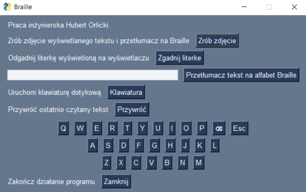
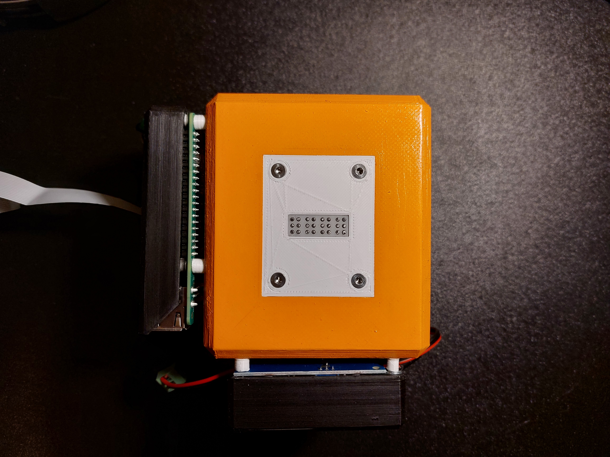

# Design and implementation of a braille display control system with a system for recognizing and processing text from an image

## General info

Here you will find my engineering work done at the Cracow University of Technology in 2023. 
The goal of the work was to create a Braille display that allows books to be scanned and displayed with additional educational options.

 

## Menu
* Zrób zdjęcie take a photo and translate its text into Braille and then show it on the display,
* Zgadnij literke -> guess the letter, the program will randomly show a letter from the alphabet on the display,
* Przetłumacz tekst na aflabet Braille -> translate typed text into Braille,
* Klawiatura -> display or hide the touchscreen keyboard,
* Przywróć ->  this button will start the last configuration of servo-motors.
 

## Required libraries for your Raspberry pi
`sudo apt install tesseract-ocr`
`sudo apt install libatlas3-base libsz2 libharfbuzz0b libtiff5 libjasper1 libilmbase12 libopenexr22 libilmbase12 libgstreamer1.0-0 libavcodec57 libavformat57 libavutil55 libswscale4 libqtgui4 libqt4-test libqtcore4`
`sudo pip3 install opencv-contrib-python libwebp6`
`sudo apt install libtesseract-dev`
`sudo pip3 install pytesseract`
`sudo pip3 install adafruit-circuitpython-servokit`
`sudo pip3 install pysimplegui`

## Electronics components
* Raspberry Pi 3B+
* PCA9685
* Camera Raspberry Pi HD v2 8MPx
* 8x servo-motor MG-90S

